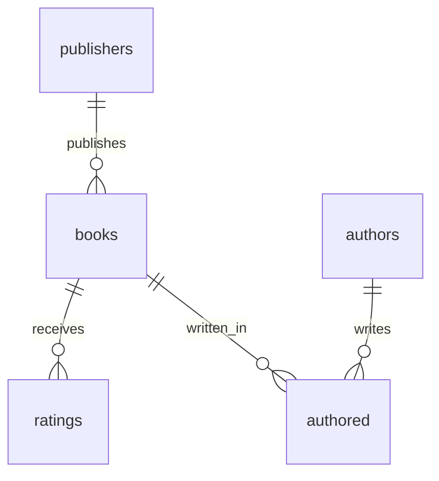

Also called an **ER diagram**. Boxes are [entities](/concepts/entities) (become [tables](/concepts/tables)). Lines are [relationships](/concepts/relationships). Marks on the line show [cardinality](/concepts/relationships#cardinality).

**Crow’s foot** is the industry default (this course). **Chen** is the academic alternative.

## Crow's foot

Marks sit at each **end** of the line — next to the entity they describe.

### Symbols

| Symbol | Meaning |
| --- | --- |
| Circle | Zero (optional) |
| Bar | One |
| Crow’s foot (three prongs) | Many |

### Ends

| Marks at the end | Meaning |
| --- | --- |
| Bar + bar | Exactly one |
| Circle + bar | Zero or one |
| Bar + crow’s foot | One or many |
| Circle + crow’s foot | Zero or many |

Read **toward** the entity beside the marks.

| In Mermaid | Same as | Meaning |
| --- | --- | --- |
| `\|\|` | Bar + bar | Exactly one |
| `o\|` | Circle + bar | Zero or one |
| `\|{` | Bar + crow’s foot | One or many |
| `o{` | Circle + crow’s foot | Zero or many |

`publishers ||--o{ books` → one publisher, zero or many books. `authored` is the [join table](/concepts/keys#join-tables) (many ↔ many).

## Chen

Peter Chen, 1976 — textbooks more than industry tools.

| Shape | Meaning |
| --- | --- |
| Rectangle | Entity |
| Diamond | Relationship (for example *writes* between `authors` and `books`) |
| Oval | Attribute; **underline** the primary key |

Cardinality on the line as `1`, `N`, or `M` — not crow’s-foot symbols.

## Why

Map before [schema](/concepts/schemas). See where a [foreign key](/concepts/keys#foreign-key) goes before you `JOIN`.

## When

- **More than one table**: see the links
- **Many-to-many**: join table shows in the middle
- **Skip it when**: a single [table](/concepts/tables)
