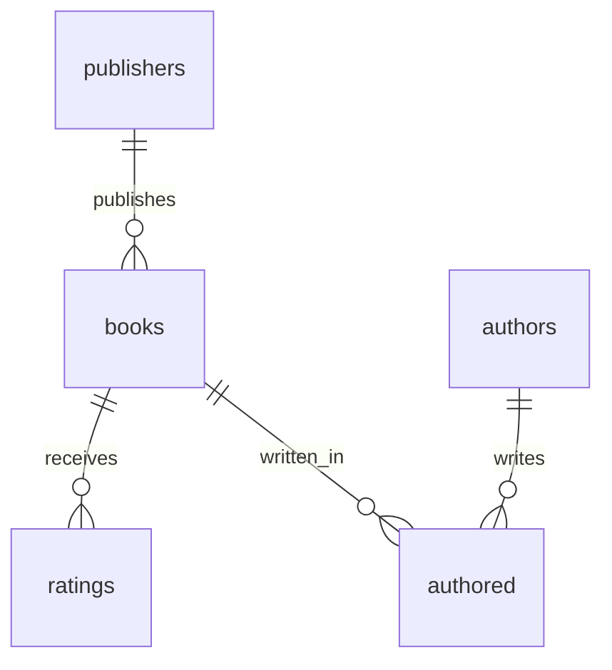

Each box is a table (an **entity**). Each line is a [relationship](/concepts/relationships). The marks on the line are **cardinality**: how many rows may sit on that end.

## How an ER diagram works

Crow’s foot notation uses a few marks:

| Mark | Meaning |
| --- | --- |
| Straight bar | Exactly one |
| Circle | Zero (optional) |
| Crow’s foot (three lines) | Many |

Read `publishers ||--o{ books` as: one publisher publishes zero or more books. Each book has one publisher.

`authored` is the [join table](/concepts/keys#join-tables). Both ends are many: an author writes many books, a book has many authors.

## Why databases use ER diagrams

The picture is the schema you will query. You see where to put a [foreign key](/concepts/keys) before you write `JOIN`.

## When to use an ER diagram

- **More than one table**: you need to see the links
- **Choosing a join table**: many-to-many shows a box in the middle
- **Skip it when**: you have a single [table](/concepts/tables)

## Related ideas

The lines match [one-to-one, one-to-many, and many-to-many](/concepts/relationships). Query along those lines with [JOIN](/how-to/join-tables).

## Common mix-ups

- **Box vs column**: a box is a table, not one column. Keys sit inside the box.
- **Line vs JOIN**: the diagram is structure. `JOIN` is how you read across it.

## Further reading

- [Relationships](/concepts/relationships)
- [Keys](/concepts/keys)
- [Normalization](/concepts/normalization)
- [Join tables](/how-to/join-tables)
